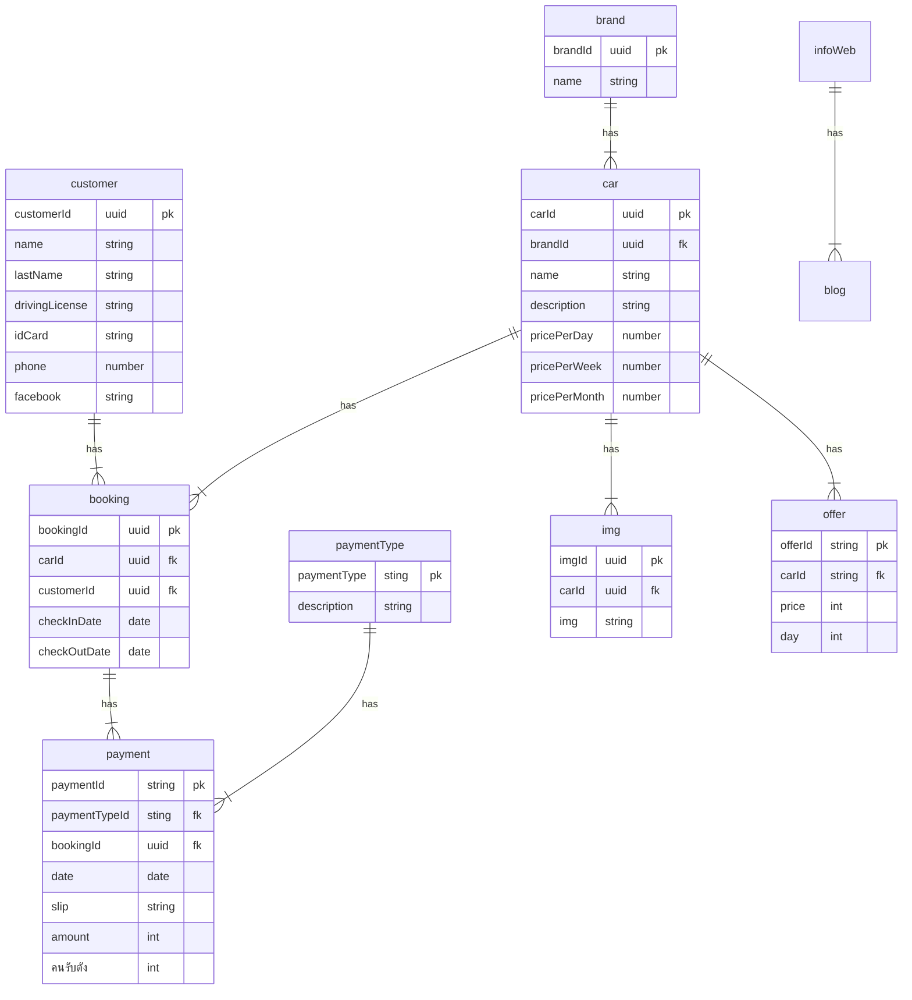

```mermaid
erDiagram

offer{
    offerId string pk
    carId string fk
    price int
    day  int
}

customer {
    customerId  uuid pk
    name string
    lastName string
    drivingLicense string
    idCard string
    phone number
    facebook string
}

paymentType {
    paymentType sting pk
    description string
}

payment{
    paymentId string pk
    paymentTypeId sting fk
    bookingId uuid fk
    date date
    slip string
    amount int
    คนรับตัง int
}

booking{
    bookingId uuid pk
    carId uuid fk
    customerId uuid fk
    checkInDate date
    checkOutDate date
}
car{
    carId uuid pk
    brandId uuid fk
    name string
    description string
    pricePerDay number
    pricePerWeek number
    pricePerMonth number
}
img{
    imgId uuid pk
    carId uuid fk
    img string
}
brand{
    brandId uuid pk
    name string
}

infoWeb{
}


car ||--|{ booking : has
customer ||--|{ booking: has
car ||--|{ img : has
infoWeb ||--|{ blog :has
brand ||--|{ car :has
booking ||--|{ payment : has
paymentType ||--|{ payment: has
car||--|{ offer:has
```
